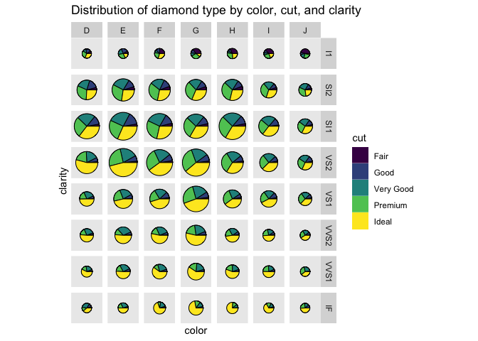

<!-- README.md is generated from README.Rmd. Please edit that file -->

# StrawberryRhubarb

<!-- badges: start -->

<!-- badges: end -->

Pies in ggplot, at last.

``` r
library(ggplot2)
library(StrawberryRhubarb)
library(dplyr, warn.conflicts = F)
ggplot2::diamonds %>% 
  count(cut) %>% 
  ggplot(aes(theta = n, fill = cut)) +
  geom_pie() +
  coord_fixed() +
  labs(title = "Hello, World!")
```


``` r

ggplot2::diamonds %>% 
  count(cut, clarity, color) %>% 
  group_by(clarity, color) %>% 
  mutate(total_n = sum(n)) %>% 
  ggplot(aes(theta = n, fill = cut, radius = scales::rescale(total_n, c(.15, .45)))) +
  facet_grid(clarity ~ color) +
  geom_pie() + 
  coord_fixed() +
  labs(title = "Distribution of diamond type by color, cut, and clarity",
       y = "clarity", x = "color")
```


