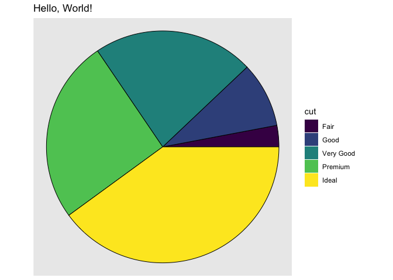

<!-- README.md is generated from README.Rmd. Please edit that file -->

# StrawberryRhubarb

<!-- badges: start -->

<!-- badges: end -->

Pies in ggplot, at last.

``` r
library(ggplot2)
library(StrawberryRhubarb)
library(dplyr)
#> 
#> Attaching package: 'dplyr'
#> The following objects are masked from 'package:stats':
#> 
#>     filter, lag
#> The following objects are masked from 'package:base':
#> 
#>     intersect, setdiff, setequal, union
ggplot2::diamonds %>% 
  count(cut) %>% 
  ggplot(aes(theta = n, fill = cut)) +
  geom_pie() +
  coord_fixed() +
  labs(title = "Hello, World!")
```


